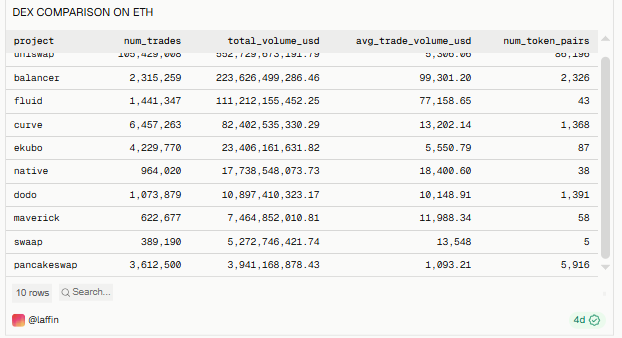
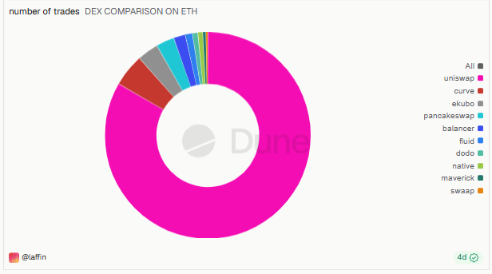
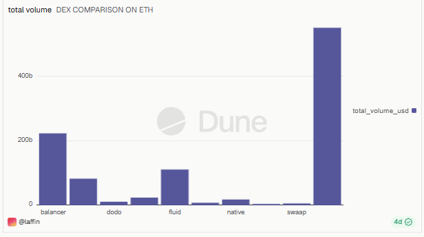
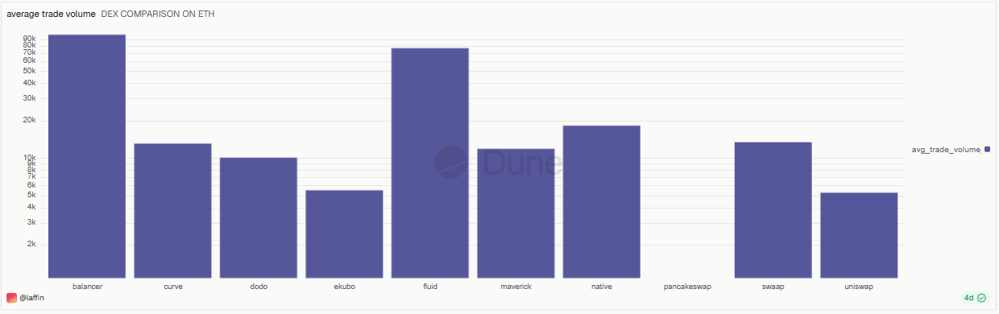
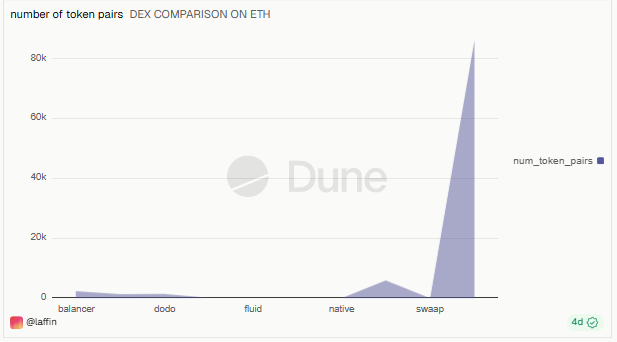

# Comparison of DEXs on Ethereum (1 Year)

## Overview
This dashboard compares the top decentralized exchanges (DEXs) on **Ethereum** over a trailing **365-day window**, ranking them by total trading volume and breaking down trade count, average trade size, and token pair diversity.

🔗 **Live Dashboard:** [View on Dune](https://dune.com/laffin/comparison-of-dexs-on-ethereum-over-the-last-year)

---

## Metrics Covered
| Metric | Description |
|---|---|
| DEX Comparison Table | Raw side-by-side comparison of all tracked DEXs |
| Number of Trades | Total trade count per DEX over the last year |
| Total Volume (USD) | Total USD trading volume per DEX over the last year |
| Average Trade Volume | Average USD size per individual trade, per DEX |
| Number of Token Pairs | Count of distinct token pairs traded per DEX |

---

## Key Observations
- **Uniswap dominates** the Ethereum DEX landscape by a wide margin leading in both total trade count and total volume, consistent with its position as the largest DEX by market share.
- **Balancer** posted the second-highest total volume ($223B) despite a comparatively modest trade count (2.3M trades), driven by the **highest average trade size** of all DEXs ($99K per trade), suggesting its volume is dominated by large trades rather than high frequency retail activity.
- **Fluid** followed a similar pattern to Balancer: relatively low trade count (1.4M) but high total volume ($111B) and a high average trade size ($77K), pointing to large-ticket trading activity.
- **Curve** and **Ekubo** had high trade counts (6.4M and 4.2M respectively) but lower average trade sizes ($13K and $5.5K), indicating more frequent, smaller value trades, typical of stablecoin/low-slippage swap activity on Curve.
- **PancakeSwap** and **Swaap** stood out for **token pair diversity**, with PancakeSwap listing 5,916 pairs and Swaap 5,548 far more than any other DEX, despite comparatively low total volume, suggesting a long tail of low liquidity pairs rather than concentrated trading.
- Overall, the data highlights a split between **high-volume/low-frequency "whale" DEXs** (Balancer, Fluid) and **high-frequency/high-diversity DEXs** (Curve, PancakeSwap, Swaap).

*(Figures are approximate, read from the query result table over the captured 365-day window, exact values shift as the dashboard refreshes.)*

---

## Query

All 5 visuals on this dashboard are powered by a **single shared query**, the dashboard simply charts different columns (`num_trades`, `total_volume_usd`, `avg_trade_volume_usd`, `num_token_pairs`) from the same result set.

| Query | File |
|---|---|
| DEX Comparison on Ethereum | [`queries/dex_comparison_on_eth.sql`](./queries/dex_comparison_on_eth.sql) |

The query runs against Dune's `dex.trades` table, filtered to `blockchain = 'ethereum'` and a rolling 365-day window (`block_time >= CURRENT_DATE - INTERVAL '365' DAY`), grouped by `project`.

---

## Screenshots

### DEX Comparison Table

### Number of Trades

### Total Volume

### Average Trade Volume

### Number of Token Pairs

---

## Tools Used
- **Dune Analytics** (SQL engine, Spellbook decoded tables)
- **Ethereum** blockchain data (`dex.trades`)
- Cross-DEX comparison: Uniswap, Balancer, Curve, Fluid, Ekubo, Native, Dodo, Maverick, Swaap, PancakeSwap
