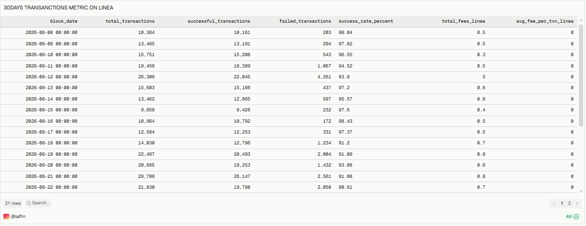
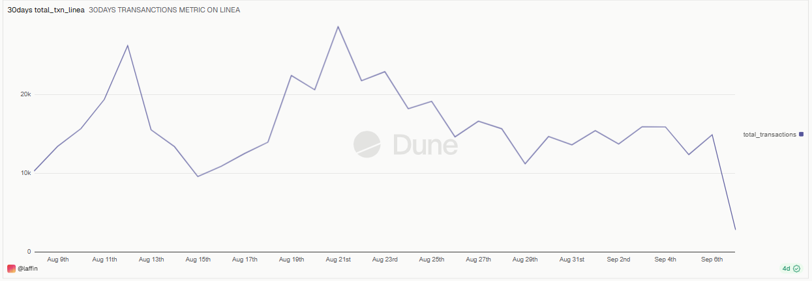
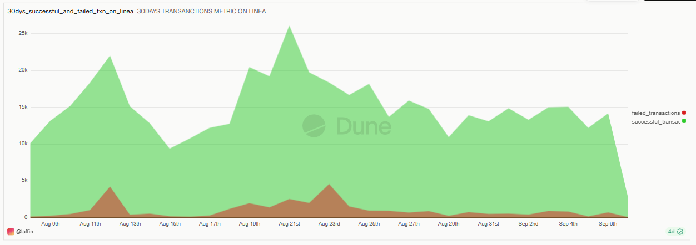
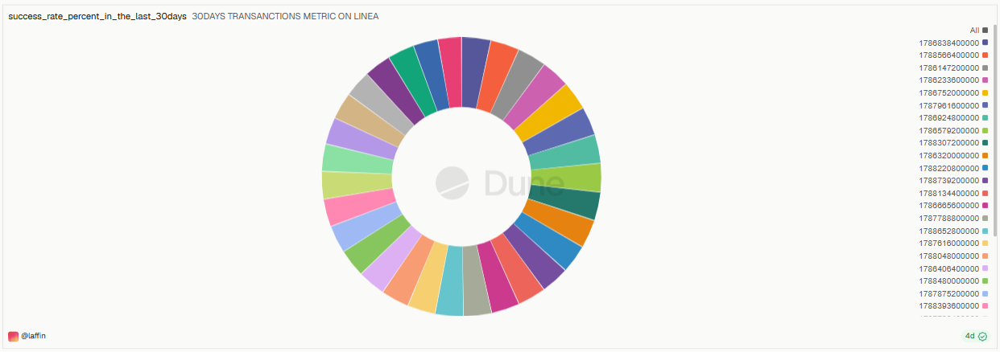
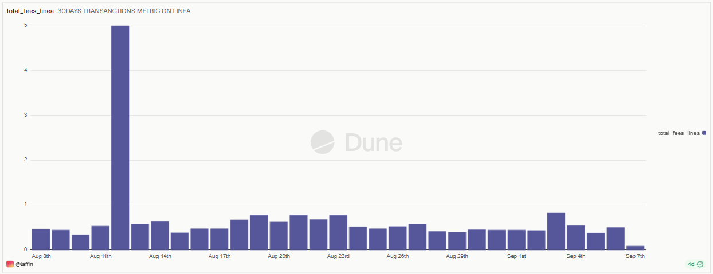
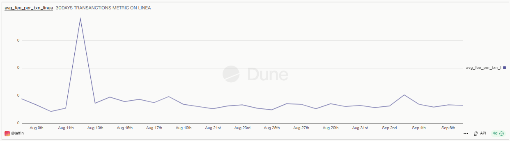

# 30 Days Transactions Metric on Linea

## Overview
This dashboard tracks daily transaction activity on **Linea** (an Ethereum Layer 2 network) over the trailing **30-day window** — covering transaction volume, success/failure rates, and gas fee trends.

🔗 **Live Dashboard:** [View on Dune](https://dune.com/laffin/30days-transactions-metric-on-linea)

---

## Metrics Covered
| Metric | Description |
|---|---|
| Total Transactions | Total daily transaction count on Linea |
| Successful & Failed Transactions | Daily breakdown of transactions by success status |
| Success Rate % | Daily percentage of transactions that succeeded |
| Total Fees on Linea | Total daily gas fees paid, in ETH |
| Average Fee per Transaction | Average gas fee paid per transaction, in ETH |

---

## Key Observations
- **Daily transaction counts** ranged from roughly **9,600 to 28,700**, with notable peaks around **Aug 11th** and again around **Aug 19th–22nd**, suggesting periods of heightened network activity.
- **Success rate stayed strong overall**, generally sitting between **91% and 98%** on most days — but dropped to a low of **~83.8% on Aug 12th**, coinciding with the day's highest failed-transaction count (4,261) and total transaction count (26,306). This points to a period of network congestion or a specific event driving up failures.
- **Total fees paid on Linea** were consistently low (typically under 1 ETH/day) but spiked sharply to roughly **5 ETH on Aug 11th–12th**, aligning with the surge in transaction volume and failed transactions — consistent with gas prices rising under network stress.
- **Average fee per transaction** followed the same pattern, spiking briefly around Aug 11th–12th before returning to its normal low, stable baseline for the rest of the 30-day window.
- Together, these metrics suggest Linea handled a short burst of congestion around **Aug 11th–12th** (higher fees, more failures, lower success rate) but otherwise maintained stable, high-success-rate transaction processing for the remainder of the period.

*(Figures are approximate, read from the query result table over the captured 30-day window — exact values shift as the dashboard refreshes.)*

---

## Query

All 5 visuals on this dashboard are powered by a **single shared query** — the dashboard simply charts different columns (`total_transactions`, `successful_transactions`, `failed_transactions`, `success_rate_percent`, `total_fees_linea`, `avg_fee_per_txn_linea`) from the same daily result set.

| Query | File |
|---|---|
| Transactions Metric on Linea | [`queries/transactions_metric_on_linea.sql`](./queries/transactions_metric_on_linea.sql) |

The query runs against Dune's `linea.transactions` table over a rolling 30-day window (`block_date >= CURRENT_DATE - INTERVAL '30' DAY`), computing gas fees as `gas_used * gas_price / 1e18` (converting wei to ETH) and grouping by `block_date`.

---

## Screenshots

### Transactions Metric Table

### Total Transactions

### Successful & Failed Transactions

### Success Rate %

### Total Fees on Linea

### Average Fee per Transaction

---

## Tools Used
- **Dune Analytics** (SQL engine, Spellbook decoded tables)
- **Linea** blockchain data (`linea.transactions`)
