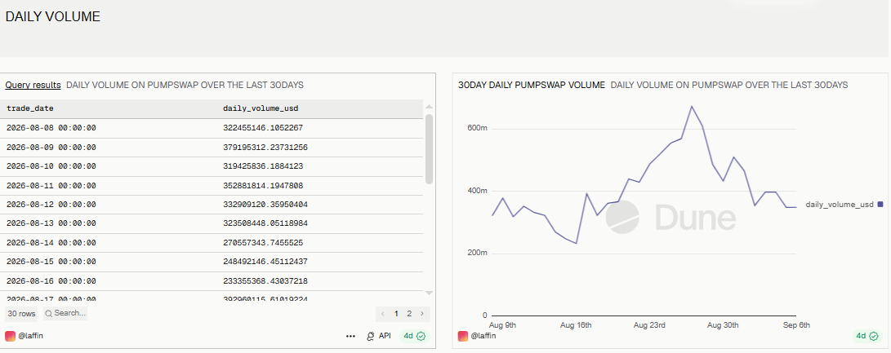
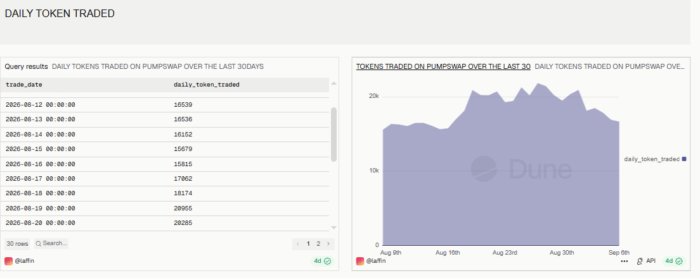
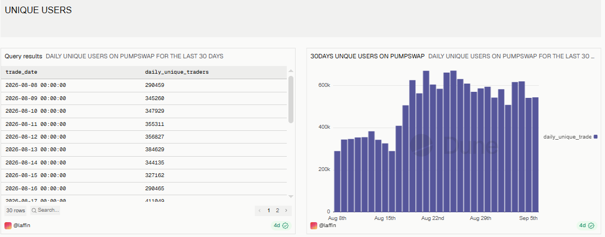
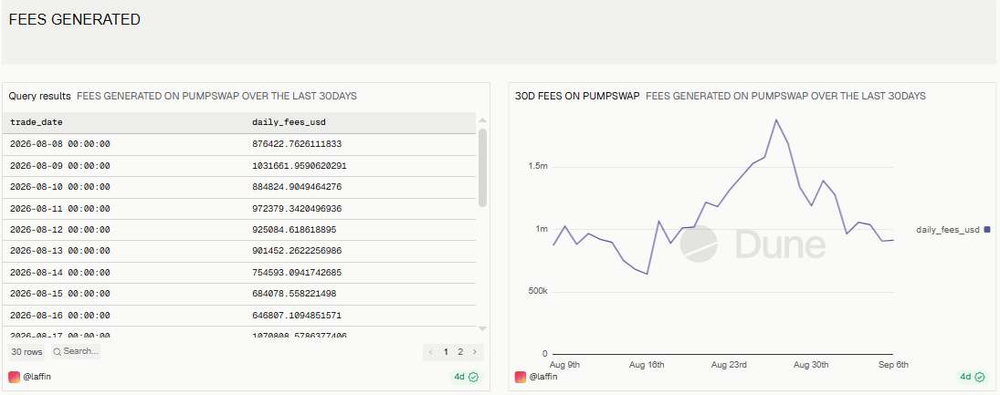

# PumpSwap Analysis — Last 30 Days

## Overview
This dashboard analyzes trading activity on **PumpSwap**, a decentralized exchange (DEX) built on the **Solana** blockchain, over a rolling **30-day window**. It tracks trading volume, token diversity, user activity, and protocol fee generation to give a snapshot of overall DEX health and usage trends.

🔗 **Live Dashboard:** [View on Dune](https://dune.com/laffin/pumpswap-analysis-over-the-last-30days)

---

## Metrics Covered
| Metric | Description |
|---|---|
| Daily Volume | Total USD trading volume executed on PumpSwap per day |
| Daily Tokens Traded | Count of distinct tokens (bought + sold) traded per day |
| Unique Users | Count of distinct trader wallets active per day |
| Fees Generated | Total USD in protocol fees generated per day |

---

## Key Observations
- **Volume** fluctuated between roughly **$230M–$600M** per day over the period, with a sharp peak in late August before pulling back and stabilizing near $300–350M.
- **Tokens traded** per day trended upward through the month, moving from around **15K** to a peak near **21K**, suggesting growing token diversity/listings on the platform.
- **Unique daily traders** grew significantly through the middle of the window, climbing from roughly **290K to a peak above 650K**, before settling back into the 500–600K range — indicating a strong mid-period surge in user activity.
- **Fees generated** tracked closely with volume, ranging from about **$650K to $1.5M** per day, peaking alongside the volume spike.

*(Figures are approximate, based on the query result windows captured in the screenshots below — exact values will shift as the dashboard refreshes with new 30-day rolling data.)*

---

## Queries

| Query | File |
|---|---|
| Daily Volume | [`queries/daily_volume.sql`](./queries/daily_volume.sql) |
| Daily Tokens Traded | [`queries/daily_token_traded.sql`](./queries/daily_token_traded.sql) |
| Unique Users | [`queries/unique_users.sql`](./queries/unique_users.sql) |
| Fees Generated | [`queries/fees_generated.sql`](./queries/fees_generated.sql) |

All queries run against Dune's `dex_solana.trades` table, filtered to `project = 'pumpswap'` and a rolling 30-day window (`block_time >= CURRENT_DATE - INTERVAL '30' DAY`).

---

## Screenshots

### Daily Volume

### Daily Tokens Traded

### Unique Users

### Fees Generated

---

## Tools Used
- **Dune Analytics** (SQL engine, Spellbook decoded tables)
- **Solana** blockchain data (`dex_solana.trades`)
- **PumpSwap** protocol-level filtering
