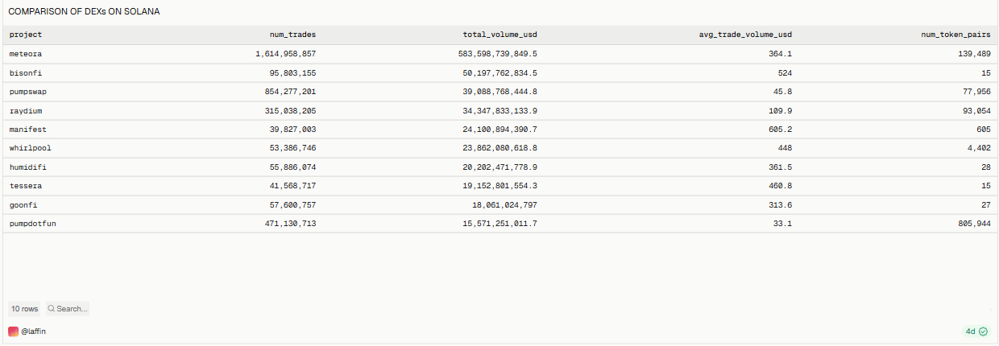
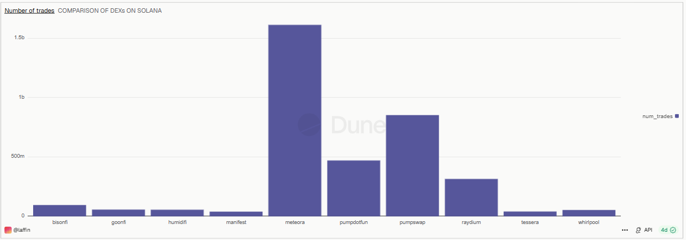
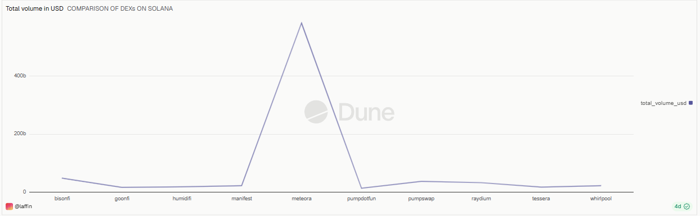
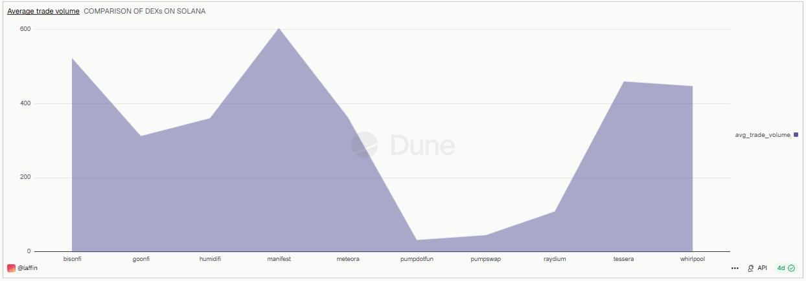
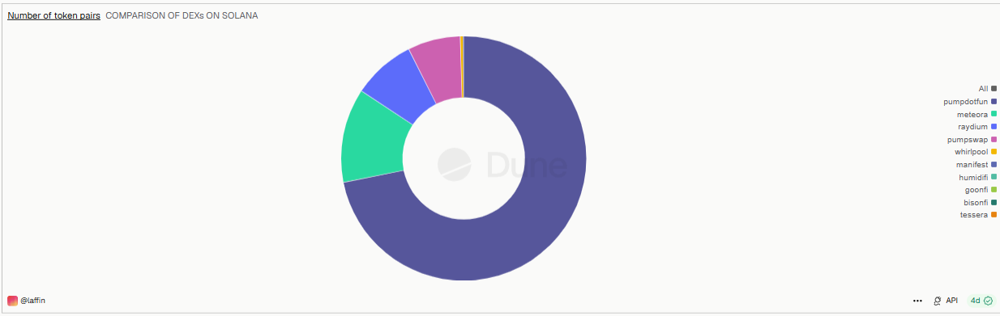

# DEXs Comparison on Solana — Last 180 Days

## Overview
This dashboard compares the top decentralized exchanges (DEXs) on **Solana** over a trailing **180-day window**, ranking them by total trading volume and breaking down trade count, average trade size, and token pair diversity.

🔗 **Live Dashboard:** [View on Dune](https://dune.com/laffin/dexs-comparison-on-solana-over-the-last-180-days)

---

## Metrics Covered
| Metric | Description |
|---|---|
| DEX Comparison Table | Raw side-by-side comparison of all tracked DEXs |
| Number of Trades | Total trade count per DEX over the last 180 days |
| Total Volume (USD) | Total USD trading volume per DEX over the last 180 days |
| Average Trade Volume | Average USD size per individual trade, per DEX |
| Number of Token Pairs | Count of distinct token pairs traded per DEX |

---

## Key Observations
- **Meteora leads by a wide margin** on both trade count (~1.6B trades) and total volume (~$584B) — making it the dominant DEX on Solana over this period, with a mid-range average trade size (~$364).
- **PumpSwap and Pump.fun** show a very different profile: extremely high trade counts (854M and 471M respectively) paired with an enormous number of token pairs (77,956 and 805,944), but the **lowest average trade sizes** on the list (~$46 and ~$33). This points to a long tail of small, high-frequency memecoin trades rather than large-value swaps.
- **Manifest** stands out with the **highest average trade volume** (~$605 per trade) despite the lowest trade count (~40M) and a small number of token pairs (605) — suggesting it's used for fewer but larger, more deliberate trades.
- **Bisonfi and Tessera** follow a similar pattern to Manifest: relatively low trade counts and token pairs, but high average trade sizes (~$524 and ~$461), again suggesting larger, less frequent trading activity.
- **Raydium** sits in the middle — solid trade count (315M) and volume (~$34B) with a large number of token pairs (93,054), reflecting its role as a broad, general-purpose Solana DEX.
- Overall, the data shows a clear split between **high-volume/general-purpose DEXs** (Meteora, Raydium) and **high-frequency/memecoin-oriented DEXs** (PumpSwap, Pump.fun) versus **low-frequency/large-trade DEXs** (Manifest, Bisonfi, Tessera).

*(Figures are approximate, read from the query result table over the captured 180-day window — exact values shift as the dashboard refreshes.)*

---

## Query

All 4 visuals on this dashboard are powered by a **single shared query** — the dashboard simply charts different columns (`num_trades`, `total_volume_usd`, `avg_trade_volume_usd`, `num_token_pairs`) from the same result set.

| Query | File |
|---|---|
| DEX Comparison on Solana | [`queries/dex_comparison_on_solana.sql`](./queries/dex_comparison_on_solana.sql) |

The query runs against Dune's `dex_solana.trades` table, filtered to `blockchain = 'solana'` and a rolling 180-day window (`block_time >= CURRENT_DATE - INTERVAL '180' DAY`), grouped by `project`.

---

## Screenshots

### DEX Comparison Table

### Number of Trades

### Total Volume in USD

### Average Trade Volume

### Number of Token Pairs

---

## Tools Used
- **Dune Analytics** (SQL engine, Spellbook decoded tables)
- **Solana** blockchain data (`dex_solana.trades`)
- Cross-DEX comparison: Meteora, Bisonfi, PumpSwap, Raydium, Manifest, Whirlpool, Humidifi, Tessera, Goonfi, Pump.fun
